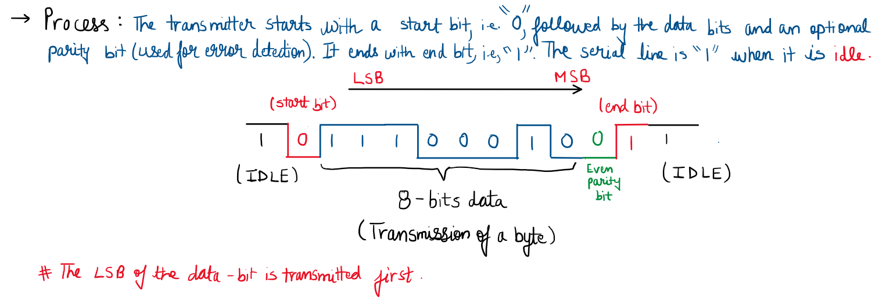
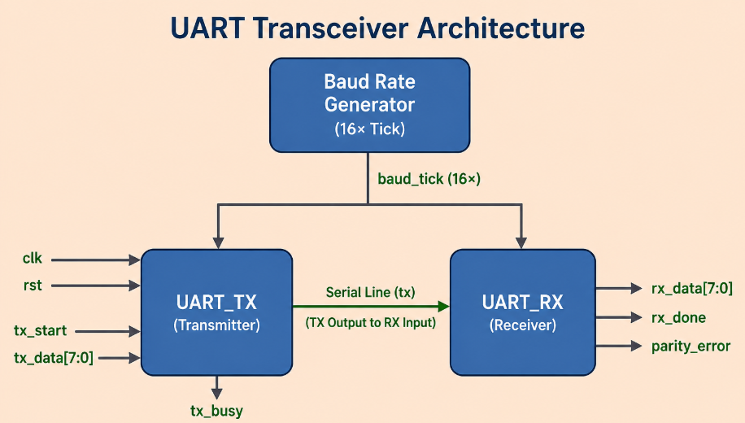
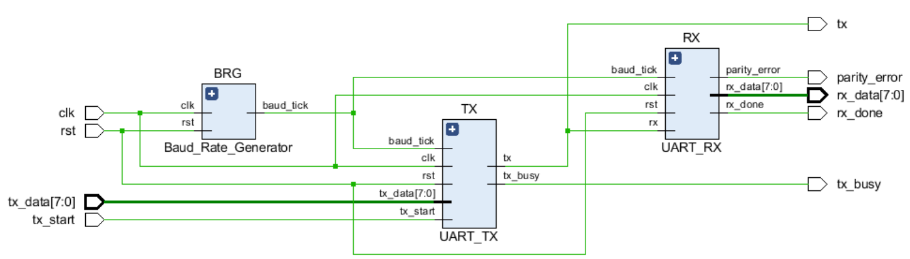
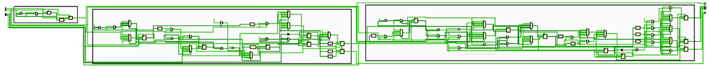
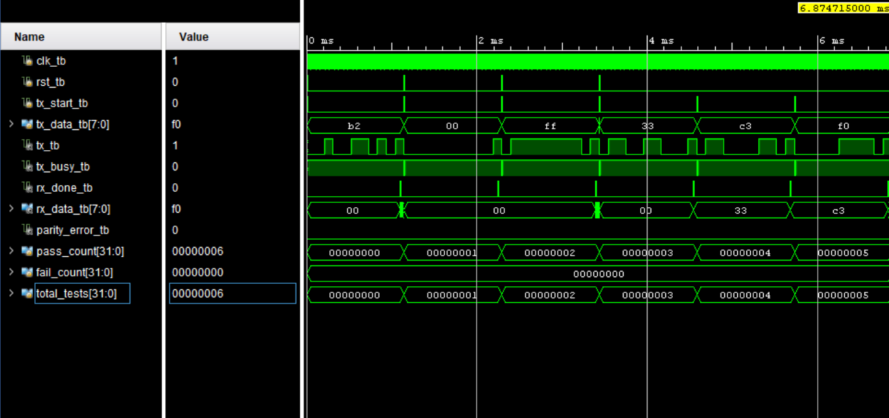
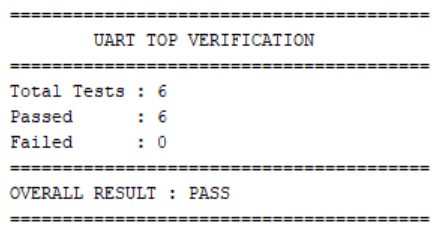

# UART-Transceiver

## 1. Overview

This project implements a UART (Universal Asynchronous Receiver/Transmitter) Transceiver in Verilog HDL. The design consists of a configurable Baud Rate Generator, an FSM-based UART Transmitter, a UART Receiver featuring **16× oversampling** for reliable asynchronous bit synchronization and false start detection, and a top-level module integrating both transmitter and receiver for end-to-end communication.

## 2. Features 

- 8-bit UART communication
- Even parity generation and verification
- 16× oversampling receiver
- Configurable baud rate via parameterized clock divider
- False start detection
- FSM-based transmitter and receiver
- Self-checking verification environment

## 3. UART Frame Format 

<div align="center">



</div>


- **Start Bit:** Logic LOW (`0`)
- **Data Bits:** 8-bit payload transmitted **LSB first**
- **Parity Bit:** Even parity for single-bit error detection
- **Stop Bit:** Logic HIGH (`1`)

## 4. Repository Structure

```text
UART_Transceiver/
│
├── src/
│   ├── Baud_Rate_Generator.v
│   ├── UART_TX.v
│   ├── UART_RX.v
│   └── UART_TOP.v
│
├── testbench/
│   ├── Baud_Rate_Generator_tb.v
│   ├── UART_TX_tb.v
│   ├── UART_RX_tb.v
│   └── UART_TOP_tb.v
│
├── images/
│   ├── frame.png
│   ├── diagram.png
│   ├── schematic.png
│   ├── expanded_schematic.png
│   ├── summary_waveform.png
│   └── summary.png
│
├── Verification.md
├── LICENSE
└── README.md

```

## 5. Architecture 

The UART Transceiver is organized as a modular RTL design consisting of a Baud Rate Generator, UART Transmitter, UART Receiver, and a top-level integration module. The Baud Rate Generator provides a shared baud tick to both the transmitter and receiver, while the transmitter's serial output (`tx`) is connected to the receiver's serial input (`rx`) through a serial communication line for end-to-end data transfer.

<div align="center">



</div>

## 6. Module Description

<div align= "center">
  
| Module | Description |
|:---------:|:-------------:|
| **Baud_Rate_Generator** | Generates the baud tick used to synchronize UART transmission and reception. |
| **UART_TX** | FSM-based transmitter that converts 8-bit parallel data into a serial UART frame with start, parity, and stop bits. |
| **UART_RX** | FSM-based receiver that reconstructs serial data into an 8-bit word using 16× oversampling and validates the parity bit. |
| **UART_TOP** | Integrates the transmitter and receiver, enabling end-to-end UART communication for system-level verification. |

</div>

## 7. Simulation & Results 

### 7.1. RTL Schematic

#### Top-level view

<div align="center">



</div>

#### Expanded view

<div align="center">



</div>

### 7.2. Top Module Waveform (full view)

<div align="center">



</div>

### 7.3. Console Output/Summary

<div align="center">



</div>

## 8. Verification 

> [!NOTE]
> A detailed discussion of the verification methodology, test cases, debugging experience, and verification results is available in [VERIFICATION.md](https://github.com/theYash856/UART-Transceiver/blob/main/VERIFICATION.md)

## 9. Key Learnings

- Developed a practical understanding of asynchronous serial communication and the UART protocol.
- Understood the importance of **16× oversampling** for reliable start-bit detection and accurate bit sampling.
- Improved RTL verification skills by developing reusable task-based, self-checking testbenches and adopting event-driven synchronization using DUT status signals.
- Strengthened debugging skills by identifying and resolving timing- and synchronization-related issues through waveform analysis.

## 10. Tools & Concepts Used

**Language:** Verilog HDL

**EDA Tools:** Xilinx Vivado (Simulation and RTL analysis). The design is also compatible with online EDA platforms.

**New Concepts Explored:** Shift Registers (PISO & SIPO), Baud Rate Generation, 16× Oversampling, Bit Timing & Synchronization, Parity Generation & Checking, Task-Based Self-Checking Verification
